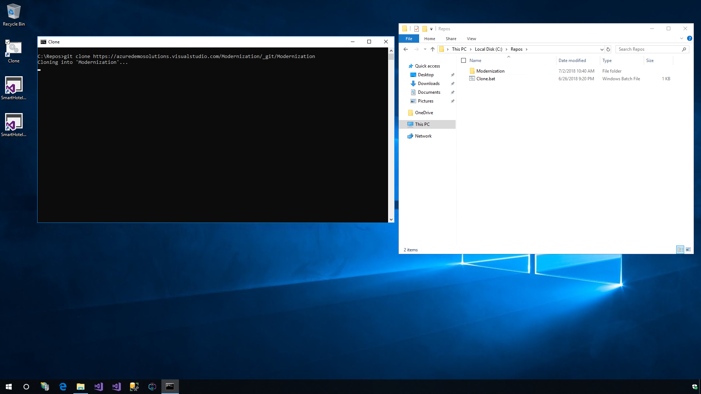

# Introduction 
Azure App Service is a service for hosting web applications, REST APIs, and mobile back ends. You can develop in your favorite language, be it .NET, .NET Core, Java, Ruby, Node.js, PHP, or Python. Applications run and scale with ease on Windows-based environments. For Linux-based environments. Web Apps not only adds the power of Microsoft Azure to your application, such as security, load balancing, auto-scaling, and automated management.

Azure makes it very easy to modernize your application portfolio. With Azure app service, you can easily migrate your existing .NET applications with very minimal effort. In this demo, we will show you different scenarios in which how you can bring a ASP.NET WebForms based application that is currently running on-premise to Azure App Service.

# Getting Started

This demo is based on SmartHotel360, which is a fictitious smart hospitality company. Due to the complexity of managing the local infrastructure, SmartHotel360 wants to re-host their web app with the less effort possible to Azure and take advantage of Platform as a Service (PaaS).

1. Simple web app running on local IIS connected to a local SQL Server database. For this scenario we are going to create the resources in Azure and the publish the website and the database.

1. Website with a WCF service dependency connected to SQL Server database. In this scenario we are going to publish the website, the WCF service and the database. This WCF service is using BasicHttp binding and without authentication.

1. Website with a WCF service dependency connected to SQL Server database but in this case SmartHotel360 only wants to re-host the website and leave the WCF service and SQL Server running on-premises.


# Deploying to Azure

There are many ways you can create and deploy the Azure resources for you app, you can create the resources in the Azure Portal or you can use Visual Studio. For this demo we are going to use Visual Studio.

1. Lets logging into the Virtual Machine with the following credentials:

```
Username: Modernization\herosolutions 
Password: Pa$$w0rd!
```

2. Lets clone the repo of our solution for this we can use the shortcut in the desktop called **Clone** or we can use the following command. Once cloned, use the shortcut in the desktop to open the solution called **SmartHotel360.Registration** or navigate to **C:\Repos\Modernization**

```
git clone https://azuredemosolutions.visualstudio.com/Modernization/_git/Modernization
```



3. Now lets right-click on the web project and click on publish.


4. In the left menu we are going to use **App Service**, in case we have one already created we can use Select Existing for this case we are going to use **Create New**.


5. We need to specify the name of the App, select the subscription, select or create a new Resource Group and select or create a Hosting Plan. In this case we used the following information:

```
App Name: SmartHotel360Registration
Subscription: Azure Hero Solutions Subscription
Resource Group (New): SmartHotel360Registration
Hosting Plan (New):
    - App Service Plan: SmartHotel360RegistrationPlan
    - Location: Central US
    - Size: S1
```


6. Since this app connects to a database we will need to click on **Create a SQL Database**, here we will need to provide the database name, create a new SQL Server and provide the credentials (username and password) for our SQL Server, we are going to use the default name for the connection string called **DefaultConnection**. Once we have completed the information we can go ahead and click Ok and then Create, this tool will connect to Azure, provide the resources and then publish the web project in the App Service. Note: In this demo we are using data sample generators so the blank database will be populated automatically the first time we open the website, you can take a look at the code for more details.


# Exploring the Azure App Service

7. Once we have deployed our app in Azure App Service the website will open automatically. 


8. Lets take a look at the several advantages of hosting web app on Azure. For this we will open the Azure Portal. Open the first tab of the Edge browser. You can also use the following URL: [https://portal.azure.com ](https://portal.azure.com)

9. Once in the Azure Portal open the **Resource Group** you created with the Visual Studio Publishing Tool. Here you will see the resources created.


10. Select the App Service in this case our App Service is called **SnartHotel360Registration**

## Global scale with high availability 

1. Lets start by clicking In the left menu of the App Service, under Settings we will find the option of Scale Up, this will show us the different tiers available for our App Services. We can change it to add or reduce resources to the App Services, as well we can select Scale out to add rules in order to add more instances to the App Services. In this case we need to create a new default rule based on CPU to add 5 instances.


## Security and compliance

App Modernization requires security and compliance and Azure App Service provides ISO, SOC, and PCI compliant.  We can choose to authenticate users with Azure Active Directory or with social login (Google, Facebook, Twitter, and Microsoft). Create IP address restrictions, manage service identities, add custom domains and SSL to your apps, as well backups you can  create restorable archive copies of your apps content, configuration and database.

1. In the left menu of the App Service under settings we can find multiple securities options such as the Authentication / Authorization where we can setup each identity provider or anonymous access. Also we find the BackUps option where we can configure the Snapshot and Backup configuration. As well we have SSL settings to setup the certificates and TLS.


## DevOps Optimization

 Setting up a Continuous Integration and Continuous Deployment (CI/CD) with Visual Studio Team Services, GitHub, BitBucket, Git, FTP, Dropbox or OneDrive have been never so easy. Azure App Services will setup the right configuration for your build definitions from your source control to your Azure App Service with the Build Provider.

 1. In the left menu we can setup the CI/CD pipeline in Deployment options or Deployment Center. Here we can find many source controls and build providers. We also can setup deployment options and deployment slots.

 
 
 ## Application Insights

Monitoring is a big part of App Modernization - understanding which features are the most used, which pages are the most visited or what is causing the most failures will help the development team to focus more on those elements. Application Insights is an extensible Application Performance Management (APM) service for web developers on multiple platforms. Use it to monitor your live web application. It will automatically detect performance anomalies. It includes powerful analytics tools to help you diagnose issues and to understand what users actually do with your app.

1. To add Application Insights to your apps you can either use the option in the left menu of your App Service or you can use Visual Studio. Just click your web project and click on **Configure Application Insights**. Make sure the SDK is updated and click on Get Started, provide the resource name and click on **Get Started**. You can also enable trace collection. Now you can re-publish your app with the profile we already created. Also, in the Azure Portal you can find a new Application Insight resource, there you will find all the metrics of your app including Failures, Performance Availability, etc. Also you can configure alerts, export, Work Items, etc.

 

## Snapshot Debugger for .NET
Debugging apps can be difficult specially if the app is running on production with  Snapshot Debugger you can take a snapshot of your in-production apps when code that you're interested in executes. The debugger lets you see exactly what went wrong, without impacting traffic of your production application. The Snapshot Debugger can help you dramatically reduce the time it takes to resolve issues that occur in production environments.

1. We need to include the Nuget package Microsoft.ApplicationInsights.SnapshotCollector in our web project. In this case we will need to introduce a bug in the code, so we need to open the class of the **Check In** page and comment the line number 19 and uncomment line 20. so the code will look like this:

```
//int.TryParse(Request.QueryString["registration"], out int registrationId);
int.TryParse(Request.QueryString["registrationId"], out int registrationId);
```

This will throw an ArgumentException in the line 23 so a new exception will store in the Application Insights and we will be able to download the snapshot for that exception.

2. In Application Insights we can go to Failures and open the exception with the error **System.ArgumentException** then we can go to the Azure Portal and find the exception generated and download the snapshot, we can open the file in Visual Studio Enterprise and debugging using the dump file.

 

You can also use **Snappoints** and **Logpoints** to make it easy to debug in production. Snappoints are like breakpoints in that they allow you to take snapshots of a system when a given line is executed, but without actually noticeably pausing the execution of the application. Logpoints work in the same way, except that they allow you to inject custom logging into production apps on the fly.

3. Use the Cloud Explorer and navigate to the App Services in Azure, right-click on the website and select create a snappoint in the similar way than a breakpoint, this will debug remotely the App Services without affecting the runtime of it. However you may need to reset the App Service in order to enable the snappoint.

 

# Deploying different scenarios
You app portfolio can include different architectures and in this demo we are going to show how Azure App Service can host different scenarios:

## Publishing a WCF in Azure App Service

Azure App Services also provide support for most of the WCF services, to demonstrate this we are going to show the second scenario which includes a WCF service with HttpBinding connected to a SQL Server Database. To deploy this we will need another App Service for the WCF service. In this case we can use the same App Service Plan that we already have for our website. 

1. We need to open the second solution called **SmartHotel.Registration.Dependency**, here we have to create another App Service with the same App Plan we already created and publish there the WCF web project. After publishing the first time the WCF is not connected to the database, we need to change the string configuration with the option configure and in the screen enter the database server name, credentials and select the SmartHotel360Registration database, after saving we can republish it and now we can go ahead and change the web.config file of the web project in order to point to the need URL of the WCF service. With the web project we can publishing it selecting an existing App Service, that one we already created.


## Using a Hybrid Connection

One of the biggest advantages of App Service is the availability to use Virtual Networks or Hybrid Connections to communicate with resources running On-premises. For the third scenario we can't move the service and database yet because other on premises applications have a dependency, in this case SmartHotel360 only wants to move their website to Azure but not their WCF and database.

1. For this scenario we can delete the WCF App Service that we created in the previous step. In the web.config file we can change it back to point to the localhost WCF service that connects to the local SQL Server. After publishing the web project we will get an error for the connection to solve this we will need to open the portal and go to the Networking option under the settings menu of the App Service, here we need to create a Hybrid Connection and with the Hybrid Connection Manager installed on the machine we need to establish the connection for this we will need to sign in and the tool will recognize the connections available. Once we select the connection and it is established we can refresh the website and it will connect to the local WCF service.


# Summary

Azure App Services enables you to Modernize your app portfolio in a very easy and painless way. You can build and host web applications in the programming language of your choice without managing infrastructure. It offers auto-scaling and high availability, supports both Windows and Linux, and enables automated deployments from GitHub, Visual Studio Team Services, or any Git repo. Get started [here with Azure App Services](https://azure.microsoft.com/services/app-service).